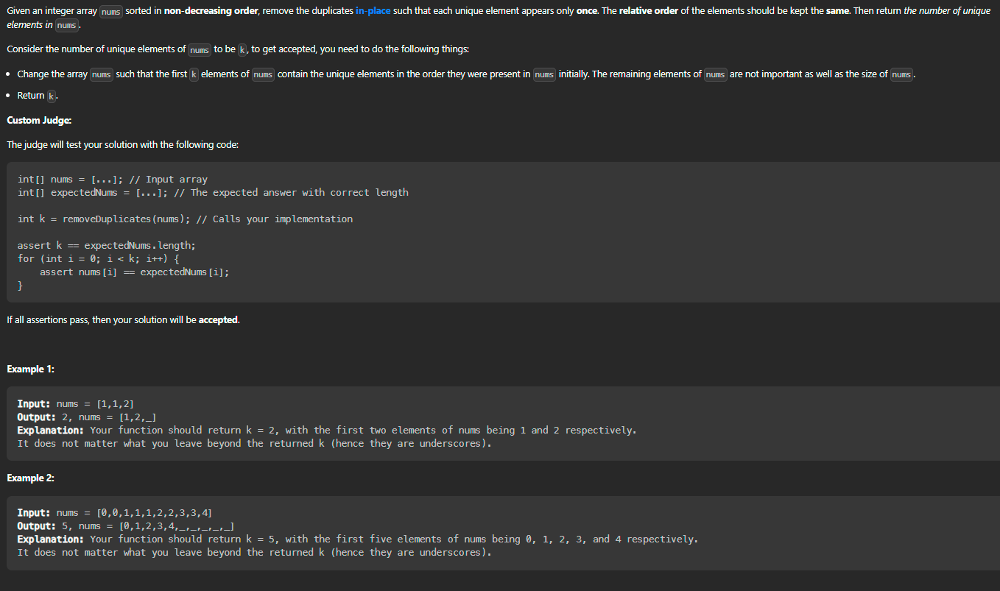

# Remove Duplicates from Sorted Array



## Example 1:
```command
Input: nums = [1,1,2]
Output: 2, nums = [1,2,_]
Explanation: Your function should return k = 2, with the first two elements of nums being 1 and 2 respectively.
It does not matter what you leave beyond the returned k (hence they are underscores).
```

## Example 2:

```command
Input: nums = [0,0,1,1,1,2,2,3,3,4]
Output: 5, nums = [0,1,2,3,4,_,_,_,_,_]
Explanation: Your function should return k = 5, with the first five elements of nums being 0, 1, 2, 3, and 4 respectively.
It does not matter what you leave beyond the returned k (hence they are underscores).
```


## Solution
Here's a detailed explanation of the removeDuplicates function in Go:
```go 

func removeDuplicates(nums []int) int {
    if len(nums) == 0 {
		return 0
	}
	k := 1
	for i := 1; i < len(nums); i++ {
		if nums[i] != nums[i-1] {
			nums[k] = nums[i]
			k++
		}
	}
	return k
}

```
The `removeDuplicates` function takes a slice of integers as input and returns an integer. The integer returned by the function is the number of unique elements in the input slice. The function modifies the input slice to remove any duplicates and keeps the unique elements in the beginning of the slice.

The function starts by checking if the input slice is empty. If it is, the function returns 0 because there are no unique elements in an empty slice.
```go
if len(nums) == 0 {
    return 0
}

```
If the input slice is not empty, the function initializes a variable k to 1. The variable k will be used to keep track of the index in the input slice where the next unique element should be stored. The function starts with k set to 1 because the first element of the input slice is already a unique element.

```go 
k := 1

```
The function then loops through the input slice from the second element to the last element. The loop uses a variable `i` to keep track of the current index in the input slice.

```go
for i := 1; i < len(nums); i++ {
    // ...
}

```
Inside the loop, the function checks if the current element at index `i` is different from the previous element at index `i-1`. If the current element is different, it means that the current element is a unique element that should be stored in the input slice at the index `k`.

```go
if nums[i] != nums[i-1] {
    nums[k] = nums[i]
    k++
}

```
The function stores the current element at index `i` in the input slice at the index k and increments `k` by `1` to indicate that the next unique element should be stored in the input slice at the next index.

After the loop finishes, the function returns the value of `k`, which is the number of unique elements in the input slice.

```go
return k
```
